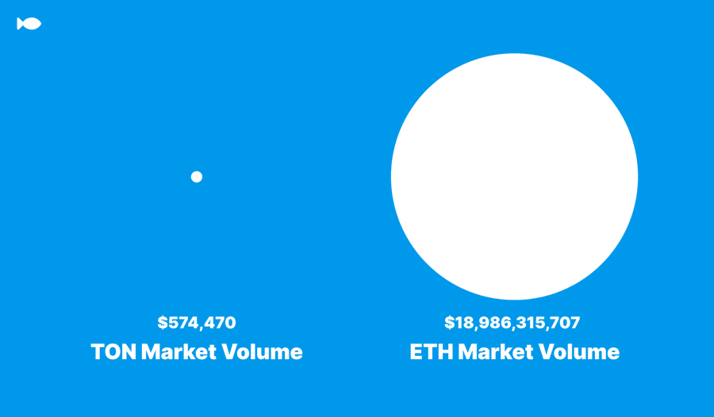
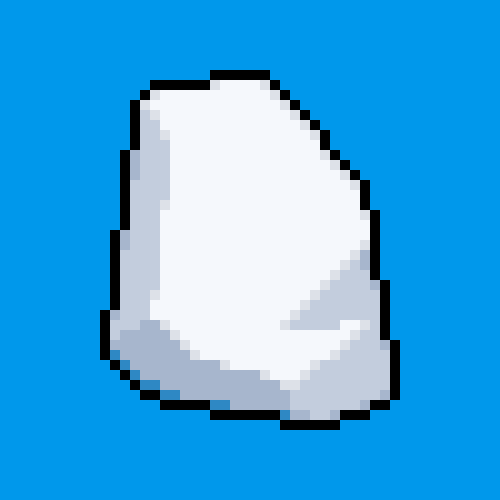

# 🐟 欢迎来到 TON $FISH 生态

你对 TON 生态系统中的第一个社交模因代币$FISH及其潜力感兴趣吗？现在就让我们来了解一下吧！ 🐟

<figure><figcaption></figcaption></figure>

1.  TON FISH 是第一个社交meme代币。 TON [$FISH](https://twitter.com/search?q=%24FISH\&src=cashtag\_click) 旨在为 TON 生态系统提供大量流动性之前，能够给更多用户创造体验 TON 生态系统的机会。🐟&#x20;

    <figure><figcaption></figcaption></figure>
2.  其中，最重要的是让用户利用各种资产在链上体验TON生态系统。🐟&#x20;

    <figure><figcaption></figcaption></figure>
3.  作为 TON FISH 生态系统的主要模因代币，$FISH 不仅有潜力增加 TON 生态系统的价值，而且有潜力增加 TON FISH生态系统其他资产的价值，例如相关NFT。因为人们 可以通过 在Upgrade 系统 使用 [$FISH](https://twitter.com/search?q=%24FISH\&src=cashtag\_click) 去升级 他们在TON 生态中的资产，这是一种更新颖的养成式meme。🐟 &#x20;

    <figure><figcaption></figcaption></figure>
4.  有了TON FISH，我们可以不再局限于资产或作品现有的价值，而是有机会通过前者去创造更多的价值，这得益于上文中提到的Upgrade机制！TON生态也拥有更大的潜力。🐟&#x20;

    <figure><figcaption></figcaption></figure>
5.  TON FISH meme 生态系统的目的在于，能够让用户去体验除了 [$FISH](https://twitter.com/search?q=%24FISH\&src=cashtag\_click) 代币之外的各种链上资产，包括 NFT、PFP、GA、以及现在很火热的Inscriptions 和 tonmap等。在给用户一个更加全面的链上体验的同时，展现它潜在的投资价值！🐟&#x20;

    <figure><figcaption></figcaption></figure>
6.  TON FISH 生态中存在奖励机制，用户可以通过链上操作来获取贡献积分，包括燃烧 [$FISH](https://twitter.com/search?q=%24FISH\&src=cashtag\_click) 来使用Upgrade系统等，这表明如果用户燃烧更多的 [$FISH](https://twitter.com/search?q=%24FISH\&src=cashtag\_click) ，那么他将有机会体验到更多的链上资产，同时能够创造并获取更多的价值。🐟&#x20;

    <figure><figcaption></figcaption></figure>
7.  TON FISH 上第一个公开可用的资产是 TON ROCK。 TON ROCK 是 TON 生态系统中的第一个 ROCK 系列。 ROCK藏品是一个有价值的藏品，象征着ETH生态、BTC生态等各个区块链的早期OG。🐟&#x20;

    <figure><figcaption></figcaption></figure>
8. TON FISH 创建了 TON ROCK 系列，并将 ROCK 免费发送给 TON FISH OG。🐟&#x20;
9.  TON FISH生态系统中的第二个系列是TON FISH BOX NFT。这是TON FISH用户体验Upgrade系统的首个合集。 TON FISH BOX NFT 持有者可以参加 [$FISH](https://twitter.com/search?q=%24FISH\&src=cashtag\_click) 活动。🐟&#x20;

    <figure><figcaption></figcaption></figure>
10. 第三个TON FISH链上资产是 [$FISH](https://twitter.com/search?q=%24FISH\&src=cashtag\_click) 代币，它是TON FISH生态系统的主要资产。 [$FISH](https://twitter.com/search?q=%24FISH\&src=cashtag\_click) 代币是用于 TON FISH 生态系统升级的 meme 代币。它是一种meme代币，没有保证价值，仅供娱乐。🐟&#x20;

    <figure><figcaption></figcaption></figure>
11. 但是， [$FISH](https://twitter.com/search?q=%24FISH\&src=cashtag\_click) 对于TON生态系统链上资产的升级具有重要作用。🐟
12. 升级 🐟🐟\
    前文提到在TON FISH 生态系统中存在Upgrade 系统，这是 TON 生态系统中的第一个允许资产升级的系统。通过Upgrade系统，允许用户使用 [$FISH](https://twitter.com/search?q=%24FISH\&src=cashtag\_click) 代币来升级他们在 TON 生态系统中的链上资产。🐟🐟🐟 &#x20;

    <figure><figcaption></figcaption></figure>
13. 升级后的链上资产将获得更高的稀有度，消费 [$FISH](https://twitter.com/search?q=%24FISH\&src=cashtag\_click) 的用户将获得贡献点。此外，所有用于升级的 [$FISH](https://twitter.com/search?q=%24FISH\&src=cashtag\_click) 代币都将被销毁。🐟&#x20;

    <figure><figcaption></figcaption></figure>
14. TON FISH升级系统将提供新的销毁方式 [$FISH](https://twitter.com/search?q=%24FISH\&src=cashtag\_click) ，增加TON生态链上资产的稀有度，并让用户看到自己为TON FISH生态系统做出了多少贡献。🐟🐟🐟&#x20;

    <figure><figcaption></figcaption></figure>

## Quick links


[shi-jian-xian.md](gai-shu/shi-jian-xian.md)



[fa-zhan-lu-xian-tu.md](gai-shu/fa-zhan-lu-xian-tu.md)


## Get Started

We've put together some helpful guides for you to get setup with our product quickly and easily.


[can-yu-yu-shou.md](fundamentals/can-yu-yu-shou.md)



[Broken link](broken-reference)



[Broken link](broken-reference)

