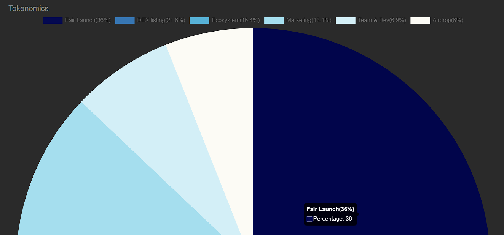

# ⏰ 时间线

* **2023.11.7**     🐟[点我跳转](https://x.com/tonfish\_tg/status/1721919752027902229?s=20)🐟\
  首次提出TON FISH 社交meme概念，包括NFT可升级计划、区块奖励计划等等。
* **2023.11.10**   🐟[点我跳转](https://x.com/wallet\_tg/status/1722910609719587000?s=20)🐟\
  钱包功能在telegram设置中可见，并逐渐投入使用，预计TON生态将会爆发。
*   **2023.11.13 - 2023.11.15**   🐟[点我跳转](https://x.com/tonfish\_tg/status/1724468356127088764?s=20)🐟\
    从TON生态OG成员开始，着手建设社区，并在当月15号发行NFT ROCK 系列，这个系列将空投给社区的OG成员&#x20;

    <figure><figcaption></figcaption></figure>
*   **2023.11.19**   🐟[点我跳转](https://x.com/tonfish\_tg/status/1726225605639991346?s=20)🐟\
    确定 $FISH 社区在TON 生态中的第一个免费的NFT为 TON FISH BOX。&#x20;

    

    <figure><figcaption></figcaption></figure>

    

* **2023.11.22 - 2023.11.29**   🐟[点我跳转](https://x.com/tonfish\_tg/status/1727182344900255819?s=20)🐟\
  推特三连，获取NFT白名单x8000 资格！参与人数有7100人。
* **2023.12.5**   🐟[点我跳转](https://x.com/tonfish\_tg/status/1731903990659473636?s=20)🐟\
  官方释放[RoadMap](https://t.me/tonfish\_en/569)
* **2023.12.6**   🐟[点我跳转](https://x.com/tonfish\_tg/status/1731903990659473636?s=20)🐟\
  在生态建设期间，在BTC铭文生态中发现新的发展方向：TON20 （FISH铭文）和TONMAP。
* **2023.12.8**   🐟[点我跳转](https://x.com/tonfish\_tg/status/1733043067513667625?s=20)🐟\
  公布 NFT FISH BOX 的铸造时间以及具体条件。
* **2023.12.15**   🐟[点我跳转](https://x.com/tonfish\_tg/status/1733043067513667625?s=20)🐟\
  mint开始，根据白名单性质，一共分为三批，每一批都有24小时的时间去铸造。铸造进度比较慢，两分钟生成一个，最大时间会持续13天左右。
*   **2023.12.16 -** **2023.12.31**  🐟[点我跳转](https://x.com/tonfish\_tg/status/1735905435671253488?s=20)🐟\
    按照路线图，提出Fair Launch具体的时间、以及参与的操作等；通过投资TON获取份额，在31号会根据份额，分发$FISH代币。贡献的前300名者，将会获得幽灵系列DGC PFP NFT（是社区中第一个动态NFT）。如何参与Fair Launch？🐟点我🐟&#x20;

    <figure><figcaption></figcaption></figure>
* **2024.01.07**  🐟点我跳转🐟\
  Fair Launch 后一周内，会进行空投的发放，空投参考因素比较多，你可以通过Fish Bot生成邀请链接

