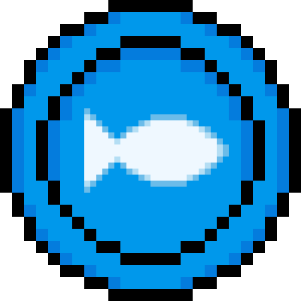
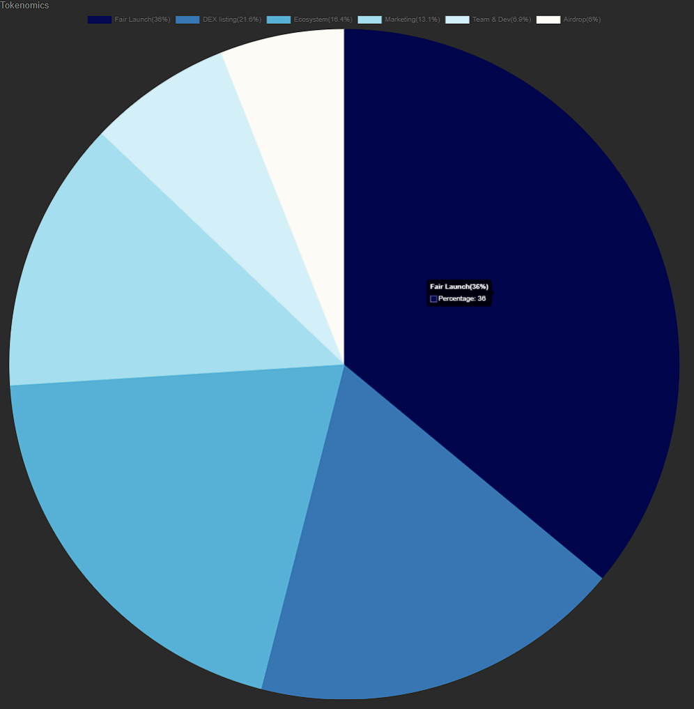

# 📎 理解项目组成




<figure><figcaption></figcaption></figure>

### $FISH TOKEN：

TON 生态下的Meme代币，$FISH 是一个受$PEPE启发的表情包。它旨在成为TON生态系统中具有代表性的模因代币。$FISH只是一个有趣的代币，不保证任何价值。

### 经济模型：

<table><thead><tr><th width="265"></th><th width="316" data-type="number"></th><th align="right"></th></tr></thead><tbody><tr><td><strong>Total Supply</strong></td><td>420690000000000</td><td align="right">100%</td></tr><tr><td><strong>Tokens for Fair Launch</strong></td><td>151448400000000</td><td align="right">36%</td></tr><tr><td><strong>Tokens for Liquidity(DEX)</strong></td><td>90869040000000</td><td align="right">21.6%</td></tr><tr><td><strong>Tokens for Ecosystem</strong></td><td>68993160000000</td><td align="right">16.4%</td></tr><tr><td><strong>Tokens for Marketing</strong></td><td>55110390000000</td><td align="right">13.1%</td></tr><tr><td><strong>Tokens for Team &#x26; DEV</strong></td><td>29027610000000</td><td align="right">6.9%</td></tr><tr><td><strong>Tokens for Airdrop</strong></td><td>25241400000000</td><td align="right">6%</td></tr></tbody></table>

<figure><figcaption></figcaption></figure>




<figure><figcaption></figcaption></figure>

### 一、TON ROCK

参考BTC以及ETH NFT生态中的石头诞生的岩石系列NFT，总供应量100，目前分布在$FISH生态的OG手中。与$FISH后续的发展计划关系并不多，相比较而言，它更像是一个见证者！

***

<figure><figcaption></figcaption></figure>

### 二、TON FISH BOX  [_🐟🐟🐟_](https://getgems.io/collection/EQAGVA6W54JOlp2Y2-\_O6mgjJoMSrKYPxej8qlYqPSjFwmKn)

TON FISH生态中的第一的NFT合集，总供应量为9999，2023年12月31日全部铸造完成。

#### **特点**

* 是$FISH社区早期参与者以及贡献者的纪念藏品，同样也是未来$FISH生态中的基石；
* 将会在2024年一月份为持有者空投部分$FISH代币；
* 这个系列的NFT将能够通过使用$FISH代币进行升级，不断提高他的品质；
* 宠物玩法，官推说明盒子中藏有宠物。
* 待定。。。。。。

***

### 三、TON DGC PFP

Deleted Ghost Club 是顶级 999 TON FISH BOX NFT 升级级别的 PFP 合集，灵感来源Telegram中已销号用户的头像，供应量为999。这是 TON FISH 系列中最稀有的，并且是仅向早期生态系统贡献者提供的特殊 PFP NFT。

#### 获取方式

* 早期og会没人会获取一个；
* Fair Launch中排名前300，每个地址将会获得一个；
* 根据已有信息，剩余NFT将会通过TON FISH BOX升级系统获取。



### Coming soon......



